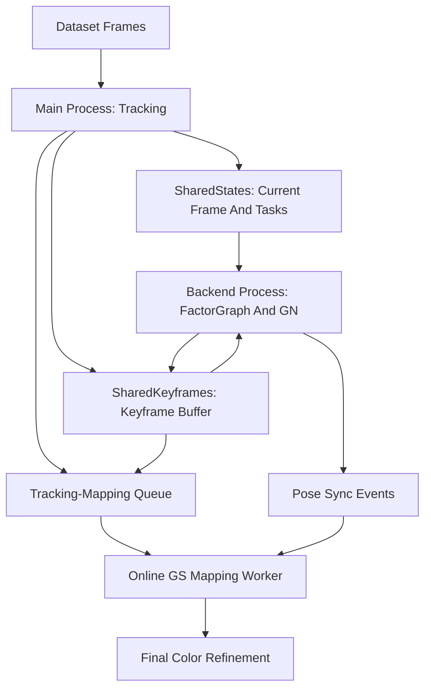

# Paper-Aligned Online 3DGS Integration

## Scope

- Mục tiêu mới: triển khai theo paper “MASt3R-GS: Bridging 3D Reconstruction Priors with Gaussian Splatting for Real-Time Dense SLAM”.
- Không thay backbone MASt3R hoặc thuật toán tracking/factor graph hiện tại.
- Giữ thiết kế decoupled: MASt3R-SLAM cung cấp pose/depth prior; 3DGS tối ưu map/rendering, không tranh quyền pose optimization với tracker.
- Tất cả function GS mới phải có tham số `threshold` để gate confidence/cap Gaussian count.

## Paper Method Summary

- Paper dùng MASt3R-SLAM calibrated mode làm front-end tracking và global consistency module.
- Tracking-mapping interface có hai nhiệm vụ chính: depth map generation từ point clouds/confidence và pose synchronization khi factor graph/loop closure cập nhật historical poses.
- Mapping chia hai stage:
  - Coarse online mapping: insert/optimize Gaussian mới theo keyframe, dùng sliding window gần nhất và thêm vài historical keyframe random; poses fixed theo frontend.
  - Fine mapping/color refinement: sau khi frontend xử lý xong toàn sequence, chạy nhiều iteration để tinh chỉnh visual quality toàn cục.
- Loss chính: RGB reconstruction, depth regularization từ MASt3R depth, isotropic scale regularization. Paper dùng trọng số gợi ý `alpha=0.95`, `lambda_iso=10`, confidence threshold khoảng `3.0` cho depth mask.
- Pose-change handling trong paper ưu tiên mapping luôn dùng pose mới nhất từ frontend, thay vì để 3DGS tự optimize pose mạnh.

## Repo Findings

- Runtime hiện tại nằm ở [`/root/MASt3R-SLAM/main.py`](/root/MASt3R-SLAM/main.py): main process đọc frame/tracking, backend process làm factor graph + GN, optional viz process.
- Shared data contract nằm ở [`/root/MASt3R-SLAM/mast3r_slam/frame.py`](/root/MASt3R-SLAM/mast3r_slam/frame.py): `SharedKeyframes` chứa ảnh, pose `T_WC`, `X_canon`, confidence, feature; `SharedStates` chứa frame hiện tại và queue optimizer.
- Pose optimization nằm ở [`/root/MASt3R-SLAM/mast3r_slam/global_opt.py`](/root/MASt3R-SLAM/mast3r_slam/global_opt.py): `solve_GN_rays/calib()` cập nhật `SharedKeyframes.update_T_WCs()` nhưng không set `is_dirty`.
- 3DGS hiện tại nằm ở [`/root/MASt3R-SLAM/mast3r_slam/gaussian_splat.py`](/root/MASt3R-SLAM/mast3r_slam/gaussian_splat.py): `extract_gaussians()` quét toàn bộ keyframes, `train_gaussian_splat()` train batch và lưu `.ply` sau SLAM.

## Architecture Diagram

## Implementation Plan

- Add a paper-aligned online GS module, likely [`/root/MASt3R-SLAM/mast3r_slam/online_gaussian_splat.py`](/root/MASt3R-SLAM/mast3r_slam/online_gaussian_splat.py), reusing helpers from [`/root/MASt3R-SLAM/mast3r_slam/gaussian_splat.py`](/root/MASt3R-SLAM/mast3r_slam/gaussian_splat.py).
- Add a lightweight `KeyframeSnapshot` payload copied from `SharedKeyframes`: `kf_idx`, `frame_id`, `uimg`, `X_canon` or generated depth, confidence map, `T_WC`, `K`, image shape.
- In [`/root/MASt3R-SLAM/main.py`](/root/MASt3R-SLAM/main.py), when a keyframe is appended, publish a `new_keyframe` mapping event. Keep event creation outside long locks.
- In [`/root/MASt3R-SLAM/mast3r_slam/global_opt.py`](/root/MASt3R-SLAM/mast3r_slam/global_opt.py), after `update_T_WCs()`, publish `pose_update` events or expose updated indices so mapping can refresh viewmats.
- Coarse online mapping worker:
  - Initialize Gaussians incrementally from each new keyframe using confidence-gated pointmap/depth.
  - Train a small budget per event over sliding window keyframes plus two random historical keyframes, matching the paper.
  - Keep poses fixed; update per-keyframe `viewmats` when pose sync arrives.
  - Use RGB + depth + isotropic losses, with existing SSIM/depth support optional behind config.
  - Enforce `max_gaussians`, `c_conf_threshold`, and per-keyframe insertion cap via `threshold`.
- Fine mapping stage:
  - Reuse/adapt current `train_gaussian_splat()` as final color refinement, but initialize from online GS state when available instead of rebuilding from scratch.
  - Save standard 3DGS `.ply` as current offline pipeline does.

## Config Additions

- Extend `gaussian_splat` config with `online_enabled`, `window_size`, `random_history`, `steps_per_keyframe`, `pose_sync`, `lambda_iso`, `alpha_rgb`, `online_save_interval`, and insertion caps.
- Keep `enabled` as existing offline/final refinement switch where possible to preserve current behavior.

## Key Technical Constraints

- Online GS cannot rely on `SharedKeyframes.is_dirty` for optimized pose updates because GN pose writes do not mark dirty.
- Poses are eventually consistent: loop closure/GN can move old keyframes, so paper-style pose synchronization is required.
- GPU contention is real: tracker, backend matching/GN, and GS training all compete for CUDA time.
- Current offline trainer assumes fixed camera set and fixed initial Gaussian extraction; online needs persistent incremental state, optimizer surgery, append/prune/densify, and final refinement.
- The paper mentions projection with distortion parameters, but this repo currently uses a `K` matrix path; first implementation should support the repo's calibrated `K` path and leave distortion support as a later extension unless dataset intrinsics expose distortion.

## Validation Plan

- Quick demo command should stay headless/no-viz per workspace rule, using `IMG_2520.mp4`.
- First validation: online worker starts, receives keyframe events, grows Gaussian count under cap, saves `.ply`.
- Second validation: pose sync updates viewmats after backend GN without crashing.
- Third validation: compare final output against current offline GS path on PSNR/visual inspection if evaluation images are available.

